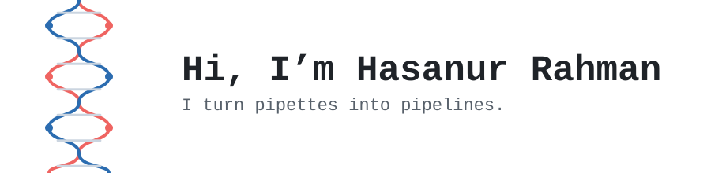

  <a href="https://www.hasanur.site/">
    <picture>
      <source media="(prefers-color-scheme: dark)" srcset="./assets/banner-dark.svg" />
      <source media="(prefers-color-scheme: light)" srcset="./assets/banner-light.svg" />
      
    </picture>
  </a>

  

  

## About Me

- 🔬 Lifescience researcher working in computational biology & genomics — self-taught into software development
- 💼 Building at [ExomeIT](http://exomeit.com/) — EMS & JMS, editorial/journal management systems for academic publishing
- 🎓 BSc in Biotechnology and Genetic Engineering
- 📈 Focused on building bioinformatics tools and pipelines
- ❤️ Write most days in Python, TypeScript, and JavaScript
- 💬 Reach me at hasan@exomeit.com

## Connect

  
  
  
  
  

## Tech Stack

  

## GitHub Stats

  
  

## Contribution Snake

  <picture>
    <source media="(prefers-color-scheme: dark)" srcset="https://raw.githubusercontent.com/hasanur-rahman079/hasanur-rahman079/output/github-contribution-grid-snake-dark.svg" />
    <source media="(prefers-color-scheme: light)" srcset="https://raw.githubusercontent.com/hasanur-rahman079/hasanur-rahman079/output/github-contribution-grid-snake.svg" />
    
  </picture>

